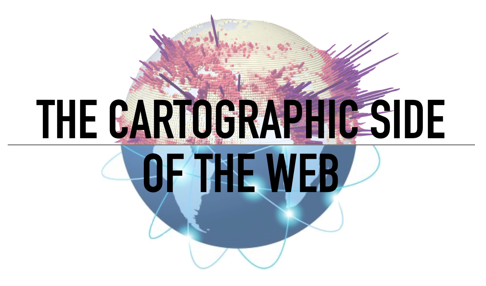
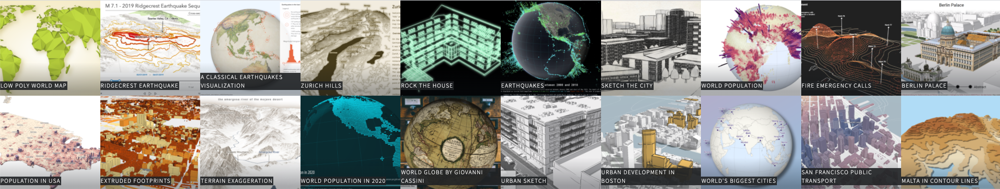
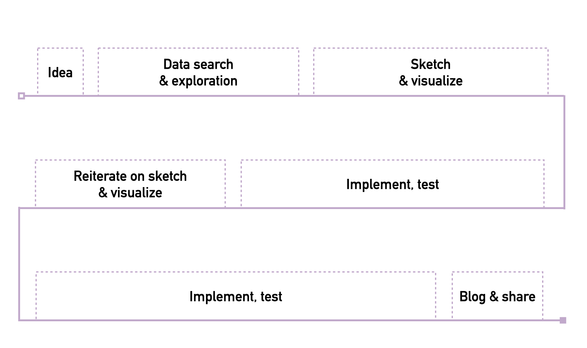
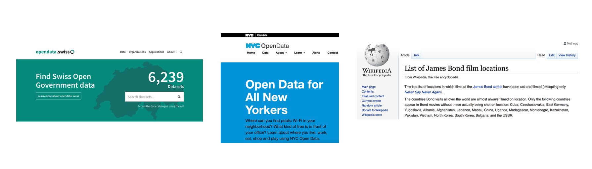
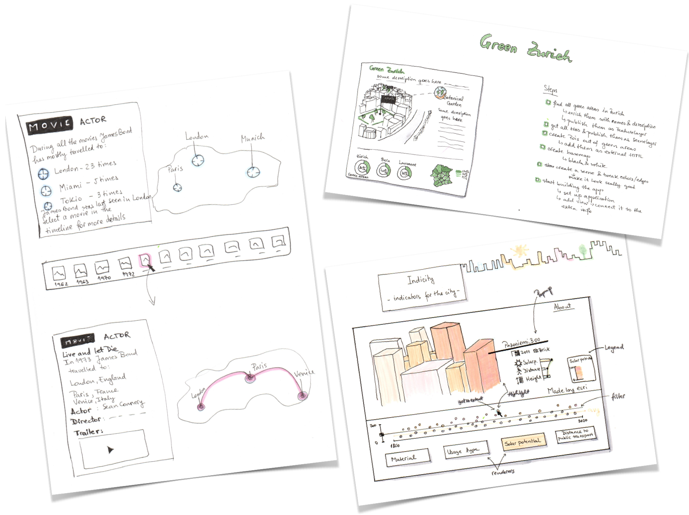

 
  [Raluca Nicola](https://raluca-nicola.net/) - Cartographer at Esri (currently on sabbatical)

 <small>
Digital Ideation, Hochschule Luzern - November 10, 2021
</small>

---

### About me

  

    <iframe data-src="./samples/locations_en.html" ></iframe>
  

---

### My daily tasks

- Provide requirements, test and write documentation for new features
- Make demos (https://ralucanicola.github.io/JSAPI_demos/)
- Write blog posts (https://www.esri.com/arcgis-blog/author/raluca_zurich/)

---

## Agenda

1. Workflow when creating maps
  - Idea > Data > Design > Implement > Test > Share

1. Examples

---

## Workflow

---

### Idea

  

  
Question - ex: where is the highest internet speed connection?

  

  

  
Inspiration - ex: a map you saw online/in a game/book

  

  

  
Personal curiosities - ex: where did James Bond travel so far?

  

---

### Data search and exploration

  

    
Get data from open data portals/parse it from websites

   
  

   

   
Explore data in ArcGIS Pro, QGIS, Excel, R

   

---

### Sketch & visualize

---

### Implementation - libraries

[ArcGIS API for JavaScript](https://developers.arcgis.com/javascript/) | [MapboxGL](https://docs.mapbox.com/mapbox-gl-js/api/) | [Leaflet](https://leafletjs.com/) | [OpenLayers](https://openlayers.org/)
 [Google Maps JavaScript API](https://developers.google.com/maps/documentation/javascript/overview) | [DeckGL](https://deck.gl/#/) | [HERE Maps API for JavaScript](https://developer.here.com/develop/javascript-api) | [HarpGL](https://www.harp.gl/) | [CesiumJS](https://cesium.com/cesiumjs/)

---

### Develop, test and share

  
 
code, code, 🍫, code

 
test, test

 
code, some more 🍫, code, code

  
 
show app to my colleagues and get feedback

 
code, code, 🍭, code

  
 
deploy, write blog post and share with everyone 🎉 🎊

---

## Examples

1. Map of outdoor activites - [Live](https://hike-visualization.netlify.app/) - [Blog](https://www.esri.com/arcgis-blog/products/js-api-arcgis/developers/map-your-outdoor-activities/)
1. Personal mobility map - [Live](https://dbabbs.github.io/mobility-map/) - [Blog](https://dylanbabbs.com/projects/mobility-map)
1. Personal experiences map - [Live](https://moriartynaps.org/maps-of-home/)
1. Election map of USA - [Live](http://try-to-impeach-this.jetpack.ai/) - [Blog](https://www.karim.news/project/try-to-impeach-trhis)
1. Election map of Romania - [Live](https://raluca-nicola.net/romania-elections/eu-parliament-2019/) - [Blog](https://raluca-nicola.net/colors-of-romania)
1. Covid Pulse - [Live](https://livingatlas.arcgis.com/covidpulse/#@=-77.314,38.88,8&grid=0&trendCategories=1&trendType=0&sort=0) - [Blog](https://www.esri.com/arcgis-blog/products/arcgis-living-atlas/mapping/covidpulse-update-grid-view/)
1. Map of homeless relocation in the USA - [Live](https://www.theguardian.com/us-news/ng-interactive/2017/dec/20/bussed-out-america-moves-homeless-people-country-study) - [Blog](https://www.visualcinnamon.com/portfolio/bussed-out/)
1. Educational map - [Live](https://ralucanicola.github.io/the-globe-of-extremes/) - [Blog](https://www.esri.com/arcgis-blog/products/js-api-arcgis/3d-gis/interactive-3d-globe/)
1. Touristic map - [Live](https://ralucanicola.github.io/ski-resort-map/) - [Blog](https://www.esri.com/arcgis-blog/products/js-api-arcgis/3d-gis/low-poly-ski-resort-map-1/)
1. Hand-drawn architecture - [Live](https://ralucanicola.github.io/campus-map/hand-drawn/) - [Blog](https://storymaps.arcgis.com/stories/8692e3a5c1c049ae8727e4a218eac928)

---

## Inspiration

- Andy Woodruff - [Portfolio](https://andywoodruff.com/)
 
- Dylan Babbs - [Portfolio](https://dylanbabbs.com/)
 
- Karim Douieb - [Portfolio](https://www.karim.news/)
 
- Nadieh Bremer - [Portfolio](https://www.visualcinnamon.com/portfolio/)
 
- John Nelson - [Blog](https://adventuresinmapping.com/), [Youtube](https://www.youtube.com/channel/UCpdwmy5JTFNUkKknxHH9Dsg)
 
- Joshua Stevens - [Blog](https://www.joshuastevens.net/)
 
- Sarah Bell - [Blog](https://www.sarahbellmaps.com/)

- Warren Davison - [Portfolio](https://warrenrdavison.wixsite.com/maps)
 
- Jonah Adkins - [Portfolio](https://www.jonahadkins.com/projects/)
 
- Eleanor Lutz - [Portfolio](https://eleanorlutz.com/)
 
- Daniel Coe - [Portfolio](https://dancoecarto.com/)
 
- Dylan Moriarty - [Blog](https://moriartynaps.org/)
 
- Mike Hall - [Portfolio](https://www.thisismikehall.com/)
 
- Daniel Huffman - [Portfolio](https://somethingaboutmaps.com/Portfolio)

---

## Questions? 🤔

 <small>
📧 ralucagnicola@gmail.com
</small>

