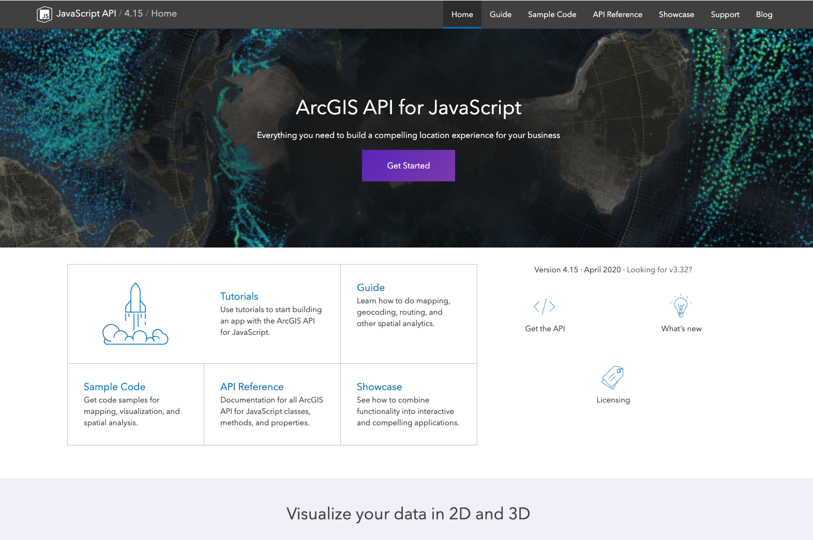
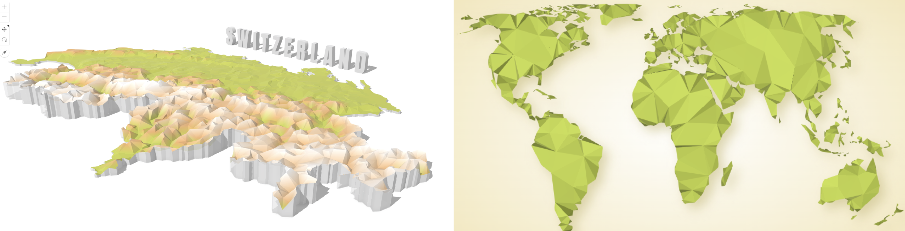
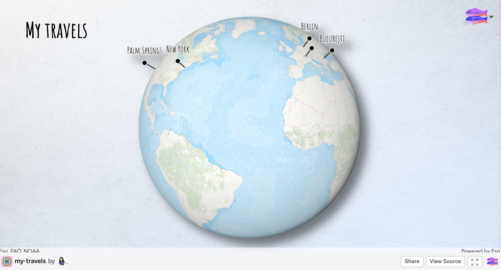

 
  Raluca Nicola - Product Engineer ArcGIS API for JavaScript

 <small>
Digital Ideation, Hochschule Luzern - November 4, 2020
</small>

---

### About me

  

    <iframe data-src="./samples/locations_en.html" ></iframe>
  

---

### [ArcGIS API for JavaScript](https://developers.arcgis.com/javascript/)

Library for visualizing geospatial data in 2D and 3D on the web

---

### My daily tasks

- Provide requirements, test and write documentation for new features
- Make demos (https://ralucanicola.github.io/JSAPI_demos/)
- Write blog posts (https://www.esri.com/arcgis-blog/author/raluca_zurich/)

---

## Agenda

1. Workflow when creating maps
  - Idea > Data > Design > Implement > Test > Share

1. Examples
  - Location maps
  - Data-driven maps
  - Artistic maps

---

## Workflow

---

### Idea

  

  
Question - ex: where is the highest internet speed connection?

  

  

  
Inspiration - ex: a map you saw online/in a game/book

  

  

  
Personal curiosities - ex: where did James Bond travel so far?

  

---

### Data search and exploration

  

    
Get data from open data portals/parse it from websites

   
  

   

   
Explore data in ArcGIS Pro, QGIS, Excel, R

   

---

### Sketch & visualize

---

### Implementation - libraries

[ArcGIS API for JavaScript](https://developers.arcgis.com/javascript/) | [MapboxGL](https://docs.mapbox.com/mapbox-gl-js/api/) | [Leaflet](https://leafletjs.com/) | [OpenLayers](https://openlayers.org/)
 [Google Maps JavaScript API](https://developers.google.com/maps/documentation/javascript/overview) | [DeckGL](https://deck.gl/#/) | [HERE Maps API for JavaScript](https://developer.here.com/develop/javascript-api) | [HarpGL](https://www.harp.gl/) | [CesiumJS](https://cesium.com/cesiumjs/)

---

### Develop, test and share

  
 
code, code, 🍫, code

 
test, test

 
code, some more 🍫, code, code

  
 
show app to my colleagues and get feedback

 
code, code, 🍭, code

  
 
deploy, write blog post and share with everyone 🎉 🎊

---

## Examples - location maps

---

### Globe of extremes

  <iframe data-src="https://ralucanicola.github.io/the-globe-of-extremes/"  style="max-width:80%"></iframe>

---

### Hiking map

  <iframe data-src="https://esri.github.io/hiking-trails-app/"></iframe>

---

## Examples - data-driven maps

---

### Proportional symbols map

<iframe data-src="https://ralucanicola.github.io/earthquakes-viz/" style="max-width:80%"></iframe>

---

### Multivariate map

  <iframe style="max-width:80%" data-src="https://raluca-nicola.net/romania-elections/eu-parliament-2019/"></iframe>

---

### Isarithmic map - contour map

  <iframe style="max-width:80%;" data-src="https://ralucanicola.github.io/JSAPI_demos/fire-emergency-calls/"></iframe>

---

### Choropleth map

  <iframe style="max-width:80%; background-color:white;" data-src="https://ralucanicola.github.io/JSAPI_demos/usa-population/"></iframe>

---

## Examples - artistic maps

---

### Sketching buildings of San Francisco

  <iframe data-src="https://ralucanicola.github.io/JSAPI_demos/sanfranart/"></iframe>

---

### Ski resort map

  <iframe data-src="https://ralucanicola.github.io/ski-resort-map/"></iframe>

---

### More low poly maps: [Switzerland](https://ralucanicola.github.io/JSAPI_demos/low-poly-switzerland/) and [A World Map](https://ralucanicola.github.io/JSAPI_demos/low-poly-world/)

---

### Ridgeline plots in 3D

  <iframe data-src="https://ralucanicola.github.io/JSAPI_demos/ridgeline-3D/"></iframe>

---

### Hands-on demo - [https://my-travels.glitch.me/](https://my-travels.glitch.me/)

---

## Questions? 🤔

 <small>
🐦 @nicolaraluk
 
 
📧 rnicola@esri.com
</small>

